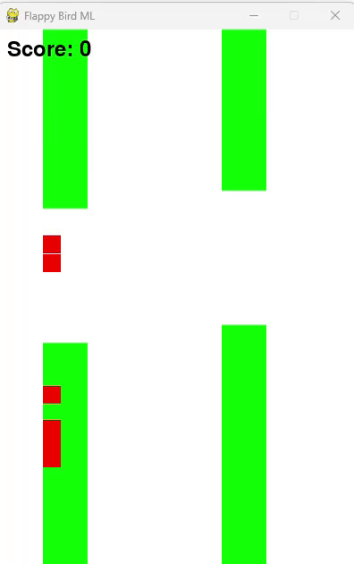

# Flappy Bird ML with Neural Networks and Genetic Algorithm

This project is a machine learning-based implementation of the Flappy Bird game, where the bird is controlled by a neural network. The game simulates an evolving population of birds using a genetic algorithm, with each generation learning to improve through mutations and crossover.

  

## **Project Structure**

- `bird.py`: Contains the `Bird` class representing the player.
- `config.py`: Contains the configuration for the neural network and evolution.
- `evolution.py`: Contains the evolutionary algorithm functions.
- `game.py`: Contains the game loop and main entry point.
- `neural_network.py`: Contains the `NeuralNetwork` class.
- `pipe.py`: Contains the `Pipe` class representing obstacles.
- `requirements.txt`: Lists the required Python packages.

## Credits

Inspired by the original Flappy Bird game. This project showcases the application of neural networks and genetic algorithms in a game-based learning environment.
